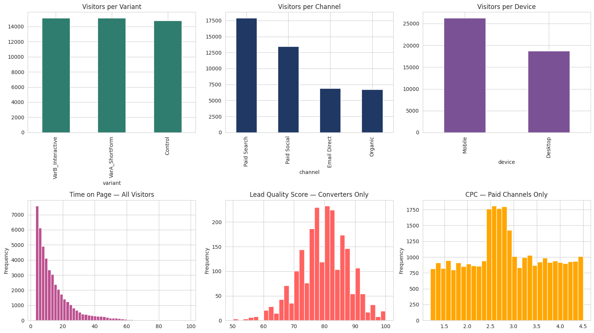
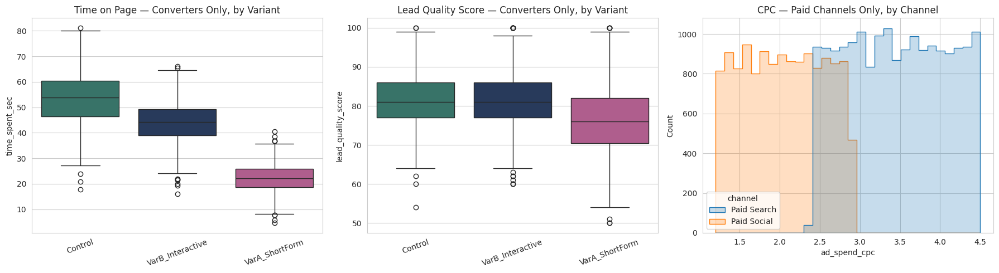

# Multi-Channel A/B Testing & Lead Optimization

This repository contains an end-to-end experimentation framework, raw dataset, and post-test analytics pipeline designed to evaluate lead generation performance across paid and organic acquisition channels.

---

## 📋 Campaign Background & Execution Strategy

To understand the dataset, we first need to establish the real-world campaign setup, user journey, and ad mechanics behind the experiment.

* **The Business Offer:** An enterprise growth consultation and audit request form hosted on a dedicated landing page.
* **The Campaign Window:** A 30-day live paid media campaign run from June 1, 2026, to June 30, 2026.
* **Ad Mechanics & Timing:** Ads ran continuously across Google Search, LinkedIn and Meta Social feeds, and dedicated email sends. When a user clicked an ad or email link, they landed on the campaign page where the lead form was displayed immediately above the fold in the main hero section.

```text
┌─────────────────────────────┐
│        HERO SECTION         │  <- visible without scrolling
│  Headline + short pitch     │
│  [ Lead Form / Variant ]    │  <- form or interactive module sits here
├─────────────────────────────┤
│      (rest of page,         │  <- below the fold, not seen
│   supporting content etc.)  │     until user scrolls
└─────────────────────────────┘


---

## 🔀 Traffic Routing Mechanics & Core Principles

A common point of confusion in A/B testing is whether a single user sees multiple form layouts. **Each individual visitor saw only one specific variant during their journey.**

When a user clicked an ad or email link, a split-URL experiment router evaluated the incoming session and assigned the user to a treatment group before the page rendered:

```text
                               ┌──> 33% of visitors ──> Control (6-Field Static Form)
[ User Clicks Ad / Link ] ────┼──> 33% of visitors ──> Variant A (3-Field Short Form)
                               └──> 34% of visitors ──> Variant B (Interactive Diagnostic)
```

### Core Routing Principles

1. **Single-Variant Experience:** If User X clicked a Google Search ad, the router assigned them to Variant B. User X saw only the interactive diagnostic module and was completely unaware that the 6-field or 3-field forms existed.
2. **Session Persistence:** The experiment router set a first-party cookie tied to `lead_id`. If User X refreshed the browser or returned two days later, they were consistently shown Variant B.
3. **Simultaneous Execution:** All three form variants ran concurrently across every channel. Running the variants simultaneously—rather than sequentially—ensured that outside factors like seasonality, day-of-week trends, and market news affected all three groups equally.

---

## 📊 Acquisition Channels & Form Tolerances

Marketing traffic is not homogeneous. A user actively seeking a solution responds differently to friction than a user casually scrolling a social feed. 

In this campaign, 45,000 unique visitor sessions were logged across four acquisition channels:

* **Paid Search (40% of traffic):** High-intent visitors arriving from Google Search ads. These users were actively looking for a solution and demonstrated tolerance for a **moderate form length** (defined as 6 standard fields capturing contact details and business context), provided every field felt directly relevant to their search query.
* **Paid Social (30% of traffic):** Mobile-heavy visitors arriving from LinkedIn and Meta feed ads. Because social ads interrupt active scrolling, these users exhibited low tolerance for traditional forms and responded best to quick, tap-based interactions.
* **Email Direct (15% of traffic):** Warm leads arriving from existing subscriber newsletters. These users already possessed brand familiarity, yielding stable conversion rates across all form layouts.
* **Organic (15% of traffic):** Unpaid search and direct referral visitors, serving as a baseline group uninfluenced by paid ad positioning.

---

## 🧪 Experimental Setup & Form Variants

Visitors were routed equally across three experimental variants (~15,000 sessions per group):

* **`Control` (Moderate Form Length - 6 Fields):** The standard industry baseline asking for Full Name, Work Email, Phone Number, Company Name, Team Size, and Primary Business Goal.
* **`VarA_ShortForm` (Short Form Length - 3 Fields):** A low-friction layout requesting only Full Name, Work Email, and Company Name.
* **`VarB_Interactive` (Multi-Step Diagnostic Flow):** A four-screen interactive widget asking 3 tap-to-select diagnostic questions (for example, "What is your main growth bottleneck?") before prompting for a final contact screen (Name, Email, and Phone Number).

---

## 📁 Data Dictionary (`lead_experiment_dataset.csv`)

Each row in the dataset represents a single visitor session.

| Column Name | Data Type | Analytical Role | Description |
| :--- | :--- | :--- | :--- |
| `lead_id` | Text (ID) | Primary Key | Unique session identifier (e.g., `LD-010000`). Used to calculate sample size ($N$). |
| `timestamp` | Datetime | Time-Series | Visitor arrival timestamp across the 30-day test window. |
| `channel` | Text | Segment | Acquisition source (`Paid Search`, `Paid Social`, `Email Direct`, or `Organic`). |
| `variant` | Text | Test Arm | Assigned landing page layout (`Control`, `VarA_ShortForm`, or `VarB_Interactive`). |
| `device` | Text | Segment | Visitor hardware category (`Mobile` or `Desktop`). |
| `time_spent_sec` | Float | Engagement | Total landing page dwell time in seconds before converting or exiting. |
| `converted` | Integer | Primary KPI | Binary indicator ($1 = \text{Lead Submitted}, 0 = \text{Exited Without Submitting}$). |
| `lead_quality_score` | Integer | Guardrail KPI | Downstream qualification score ($50\text{--}100$ for converted leads, $0$ for non-converts). |
| `ad_spend_cpc` | Float | Economics | Cost-Per-Click incurred for that specific visitor click. |

---
```

Exploratory Data Analysis (EDA)
            ↓
EDA Insights to Validate
            ↓
Hypothesis Testing
            ↓
Validated Findings
            ↓
Business Recommendations
```
---

## 🔍 Exploratory Data Analysis and Validation Checks

Before running any hypothesis test I wanted to confirm the randomization actually held and get a feel for what the data looked like, so this section walks through that process.

### What lead quality score actually is

Before looking at any plots involving this metric, it's worth being clear on what it represents. It's a 0 to 100 proxy score meant to represent how sales-ready a converted lead is, for example whether the contact info and stated needs look like a real, qualified business inquiry rather than a low intent or junk submission. It only exists for visitors who converted, non-converters are scored 0 since there's nothing to qualify. In this dataset it's generated per variant from a normal distribution defined in `generate_dataset.py` (VarA_ShortForm centered around 76.4, Control around 81.2, VarB_Interactive around 82.1, each clipped to a 50 to 100 range), so it stands in for what a sales team would normally assess manually after a lead comes in.

### Randomization checks

The first thing to check with any A/B test is whether the split actually came out balanced or whether something skewed one arm. I ran a sample ratio mismatch check comparing the actual visitor counts per variant against the expected even split. The chi-square test came back at p = 0.047, which is well within normal sampling variation for a fair three way split (SRM checks typically only flag a real problem below p = 0.001).

I also checked whether channel and device were evenly spread across the three variants, since an imbalance there would mean any difference we see later could be coming from the mix of traffic rather than the form itself. Both came back balanced (channel p = 0.30, device p = 0.79), and there were no duplicate lead ids or missing values anywhere in the file.

### Overview plots



The first pass at EDA covered the raw shape of the data: visitor counts by variant, channel and device, plus distributions for time on page, lead quality score and CPC.

The variant, channel and device counts matched what's described earlier in the Acquisition Channels and Experimental Setup sections above: a near even three way split across variants, Paid Search as the largest channel, and mobile traffic dominating overall.

The other three plots needed a second look before they made sense.

**Time on page (all visitors)** showed a steep spike near zero seconds that decayed quickly. This is the bounce behavior, people who landed and left without converting, and since only around 5 percent of visitors convert, bounces completely dominate the chart. The actual form completion times were buried in there and not visible as their own shape.

**Lead quality score (converters only)** looked like a normal bell curve centered around 75 to 85. This was already filtered to converters only, since non-converters get a score of zero by definition and would otherwise swamp the chart. On its own this plot didn't say much because it blended all three variants into one distribution.

**CPC (paid channels only)** had an odd shape, roughly flat, then a visible step up in the middle, then flat again. This turned out to be an artifact of blending two different channels into one histogram. Paid Social runs $1.20 to $2.90 per click and Paid Search runs $2.40 to $4.50, so the $2.40 to $2.90 range gets contributions from both channels while the rest of the range only gets one, creating a bump that looks like a real pattern but isn't.

### Splitting by variant and channel



Based on that, I rebuilt the last three plots split by the relevant grouping variable instead of looking at everyone combined.

**Time on page, converters only, by variant**, is not really a finding so much as a sanity check. Control has the highest median, VarB_Interactive sits in the middle, and VarA_ShortForm is fastest to fill out. That's exactly what you'd expect just from the number of fields in each form, so this isn't telling us anything new, it's confirming the data behaves the way the form designs imply before we trust anything else in it.

**Lead quality score, converters only, by variant**, is the more interesting one. Control and VarB_Interactive sit at nearly the same median, with similar spread. VarA_ShortForm sits noticeably lower, with its whole box shifted down compared to the other two. So the short form converts more visitors but the leads it brings in look lower quality, while the interactive flow does not show that same tradeoff.

**CPC, paid channels only, split by channel**, resolved the earlier odd shape. Paid Social and Paid Search each show their own roughly flat distribution over their respective price range, and the earlier bump was just the overlap of the two histograms drawn on top of each other rather than a real pattern in the cost data.


## EDA Summary and Next Steps

The exploratory data analysis identified several patterns that warrant formal statistical evaluation. While these observations provide useful direction, they should not be interpreted as statistically significant findings.

The following analyses will be performed during the hypothesis testing phase:

| Analysis Area | Purpose | Planned Statistical Test |
|---------------|---------|--------------------------|
| Sample Ratio Mismatch (SRM) | Validate that traffic was randomly assigned to each experimental variant. | Chi-Square Goodness-of-Fit |
| Traffic Source Distribution | Verify that acquisition channels are balanced across variants. | Chi-Square Test of Independence |
| Device Distribution | Verify that device types are balanced across variants. | Chi-Square Test of Independence |
| Conversion Rate | Determine whether conversion rates differ between variants. | Chi-Square Test of Independence / Two-Proportion Z-Test |
| Form Completion Time | Determine whether average completion times differ between variants. | One-Way ANOVA (or Kruskal-Wallis) |
| Lead Quality Score | Determine whether average lead quality differs between variants. | One-Way ANOVA (or Welch ANOVA) |
| Cost Per Click (CPC) | Compare average CPC between Paid Search and Paid Social campaigns. | Independent Samples t-Test (or Mann-Whitney U Test) |

---

---

## 🛠️ How to Run the Analysis Locally

### 1. Requirements
Install the required Python packages:

```bash
pip install pandas numpy matplotlib seaborn scipy statsmodels
```


---

## 📁 Repository Structure

```text
├── lead_experiment_dataset.csv  # Raw 45,000-row multi-channel dataset
├── generate_dataset.py          # Script for synthetic data generation
├── images/                      # EDA and results visualizations
├── README.md                    # Project documentation and campaign guide
```
