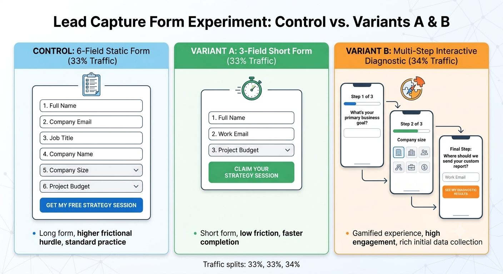
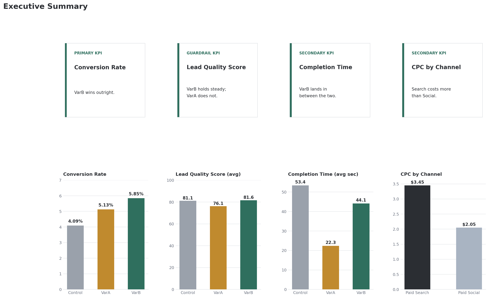

# Multi-Channel A/B Testing & Lead Optimization

This project simulates a real world multi-channel marketing A/B test involving 45,000 visitor sessions. Three lead capture form designs were evaluated using exploratory analysis, chi-square tests, ANOVA, Welch ANOVA, Games–Howell post hoc comparisons and business guardrail metrics. The interactive multi-step form (VarB) significantly improved conversion without sacrificing lead quality.

---

## Campaign Background & Execution Strategy

To understand the dataset, we first need to establish the real-world campaign setup, user journey and ad mechanics behind the experiment.

* **The Business Offer:** A free 30-minute Digital Marketing Strategy Session for mid-sized business owners looking to scale their online ad leads.
* **The Campaign Window:** A 30-day live paid media campaign run from June 1, 2026, to June 30, 2026.
* **Ad Mechanics & Timing:** Ads ran continuously across Google Search, LinkedIn and Meta Social feeds and dedicated email sends. When a user clicked an ad or email link, they landed on the campaign page where the lead form was displayed immediately above the fold in the main hero section.

### Experiment Architecture & UI Flow



---

<div align="center">
  <h3>🔀 Traffic Allocation & Variant Architecture</h3>
</div>

<table width="100%">
  <tr>
    <td width="33%" valign="top" bgcolor="#f8f9fa">
      <h4>🟦 CONTROL (33%)</h4>
      <p><b>Model:</b> 6-Field Static Form</p>
      <hr>
      <p><b>UX Strategy:</b> High-friction upfront qualification gate.</p>
      <ul>
      </ul>
      <p><b>Trade-off:</b> Maximize lead quality at the cost of top-of-funnel drop-off.</p>
    </td>
    <td width="33%" valign="top" bgcolor="#f8f9fa">
      <h4>🟩 VARIANT A (33%)</h4>
      <p><b>Model:</b> 3-Field Short Form</p>
      <hr>
      <p><b>UX Strategy:</b> Low-friction volume maximization.</p>
      <ul>
      </ul>
      <p><b>Trade-off:</b> High conversion volume; potential degradation in downstream score.</p>
    </td>
    <td width="34%" valign="top" bgcolor="#f8f9fa">
      <h4>🟧 VARIANT B (34%)</h4>
      <p><b>Model:</b> Multi-Step Wizard</p>
      <hr>
      <p><b>UX Strategy:</b> Progressive disclosure interactive diagnostic.</p>
      <ul>
      </ul>
      <br>
      <p><b>Trade-off:</b> Mitigates cognitive load while retaining rich data payload.</p>
    </td>
  </tr>
</table>


## 🔀 Traffic Routing Mechanics & Core Principles

 **Each individual visitor saw only one specific variant during their journey.**

When a user clicked an ad or email link, a split-URL experiment router evaluated the incoming session and assigned the user to a treatment group before the page rendered:

```text
                               ┌──> 33% of visitors ──> Control (6-Field Static Form)
[ User Clicks Ad / Link ] ────┼──> 33% of visitors ──> Variant A (3-Field Short Form)
                               └──> 34% of visitors ──> Variant B (Interactive Diagnostic)
```

### Core Routing Principles

1. **Single-Variant Experience:** If User X clicked a Google Search ad, the router assigned them to Variant B. User X saw only the interactive diagnostic module and was completely unaware that the 6-field or 3-field forms existed.
2. **Session Persistence:** The experiment router set a first-party cookie tied to `lead_id`. If User X refreshed the browser or returned two days later, they were consistently shown Variant B.
3. **Simultaneous Execution:** All three form variants ran concurrently across every channel. Running the variants simultaneously rather than sequentially ensured that outside factors like seasonality, day-of-week trends and market news affected all three groups equally.

---

## Acquisition Channels & Form Tolerances

Marketing traffic is not homogeneous. A user actively seeking a solution responds differently to friction than a user casually scrolling a social feed.

In this campaign, 45,000 unique visitor sessions were logged across four acquisition channels:

* **Paid Search (40% of traffic):** High-intent visitors arriving from Google Search ads. These users were actively looking for a solution and demonstrated tolerance for a **moderate form length** (defined as 6 standard fields capturing contact details and business context), provided every field felt directly relevant to their search query.
* **Paid Social (30% of traffic):** Mobile-heavy visitors arriving from LinkedIn and Meta feed ads. Because social ads interrupt active scrolling, these users exhibited low tolerance for traditional forms and responded best to quick, tap-based interactions.
* **Email Direct (15% of traffic):** Warm leads arriving from existing subscriber newsletters. These users already possessed brand familiarity, yielding stable conversion rates across all form layouts.
* **Organic (15% of traffic):** Unpaid search and direct referral visitors, serving as a baseline group uninfluenced by paid ad positioning.

---

## Experimental Setup & Form Variants

Visitors were routed equally across three experimental variants (~15,000 sessions per group):

* **`Control` (Moderate Form Length - 6 Fields):** The standard industry baseline asking for Full Name, Work Email, Phone Number, Company Name, Team Size, and Primary Business Goal.
* **`VarA_ShortForm` (Short Form Length - 3 Fields):** A low-friction layout requesting only Full Name, Work Email, and Company Name.
* **`VarB_Interactive` (Multi-Step Diagnostic Flow):** A four-screen interactive widget asking 3 tap-to-select diagnostic questions (for example, "What is your main growth bottleneck?") before prompting for a final contact screen (Name, Email, and Phone Number).

Each variant is evaluated using a hierarchy of business metrics organized by priority:

### Evaluation Metrics
The **Primary KPI** determines the winning variant, **Secondary KPIs** provide additional business context, and the **Guardrail KPI** ensures the optimization does not negatively impact overall business value.

| Priority | Metric | Purpose | Success Criteria |
|----------|--------|---------|------------------|
| **Primary KPI** | Conversion Rate | Primary objective of the experiment - Maximize the percentage of visitors who become leads. | Highest statistically significant conversion rate |
| **Secondary KPI** | Cost per Click (CPC by channel) | Evaluates channel-level acquisition cost. | Lower or comparable CPC relative to channel benchmarks |
| **Secondary KPI** | Form Completion Time (Dwell Time) | Measures user friction during form completion. | Lower completion time without reducing conversions |
| **Guardrail KPI** | Lead Quality Score | Ensures higher conversions are not achieved by generating lower-quality leads. | Maintain or improve lead quality |

> **Why is Lead Quality a Guardrail instead of the Primary KPI?**  
> The objective of this experiment is to optimize the lead capture form for higher conversions. Lead quality remains a critical business metric, but it serves as a **guardrail** to ensure conversion gains are not achieved at the expense of attracting lower-quality leads.

---

## Data Dictionary (`lead_experiment_dataset.csv`)

Each row in the dataset represents a single visitor session.

| Column Name | Data Type | Analytical Role | Description |
| :--- | :--- | :--- | :--- |
| `lead_id` | Text (ID) | Primary Key | Unique session identifier (e.g., `LD-010000`). Used to calculate sample size ($N$). |
| `timestamp` | Datetime | Time-Series | Visitor arrival timestamp across the 30-day test window. |
| `channel` | Text | Segment | Acquisition source (`Paid Search`, `Paid Social`, `Email Direct`, or `Organic`). |
| `variant` | Text | Test Arm | Assigned landing page layout (`Control`, `VarA_ShortForm`, or `VarB_Interactive`). |
| `device` | Text | Segment | Visitor hardware category (`Mobile` or `Desktop`). |
| `time_spent_sec` | Float | Engagement | Total landing page dwell time in seconds before converting or exiting. |
| `converted` | Integer | Primary KPI | Binary indicator ($1 = \text{Lead Submitted}, 0 = \text{Exited Without Submitting}$). |
| `lead_quality_score` | Integer | Guardrail KPI | Downstream qualification score ($50\text{--}100$ for converted leads, $0$ for non-converts). |
| `ad_spend_cpc` | Float | Economics | Cost-Per-Click incurred for that specific visitor click. |

---

## Analysis Roadmap

```text
Exploratory Data Analysis (EDA)
            ↓
EDA Insights to Validate
            ↓
Hypothesis Testing
            ↓
Validated Findings
            ↓
Business Recommendations
```

---

## Exploratory Data Analysis and Validation Checks

Before running any hypothesis test I wanted to confirm the randomization actually held and get a feel for what the data looked like, so this section walks through that process.

### What lead quality score actually is

Before looking at any plots involving this metric, it's worth being clear on what it represents. It's a 0 to 100 proxy score meant to represent how sales-ready a converted lead is, for example whether the contact info and stated needs look like a real, qualified business inquiry rather than a low intent or junk submission. It only exists for visitors who converted, non-converters are scored 0 since there's nothing to qualify. In this dataset it's generated per variant from a normal distribution defined in `generate_dataset.py` (VarA_ShortForm centered around 76.4, Control around 81.2, VarB_Interactive around 82.1, each clipped to a 50 to 100 range), so it stands in for what a sales team would normally assess manually after a lead comes in.

### Randomization checks

The first thing to check with any A/B test is whether the split actually came out balanced or whether something skewed one arm. I ran a sample ratio mismatch check comparing the actual visitor counts per variant against the expected even split. The chi-square test came back at p = 0.047, which is well within normal sampling variation for a fair three way split (SRM checks typically only flag a real problem below p = 0.001).

I also checked whether channel and device were evenly spread across the three variants, since an imbalance there would mean any difference we see later could be coming from the mix of traffic rather than the form itself. Both came back balanced (channel p = 0.30, device p = 0.79), and there were no duplicate lead ids or missing values anywhere in the file.

### Overview plots


The first pass at EDA covered the raw shape of the data: visitor counts by variant, channel and device, plus distributions for time on page, lead quality score and CPC.

The variant, channel and device counts matched what's described earlier in the Acquisition Channels and Experimental Setup sections above: a near even three way split across variants, Paid Search as the largest channel, and mobile traffic dominating overall.

The other three plots needed a second look before they made sense.

**Time on page (all visitors)** showed a steep spike near zero seconds that decayed quickly. This is the bounce behavior, people who landed and left without converting, and since only around 5 percent of visitors convert, bounces completely dominate the chart. The actual form completion times were buried in there and not visible as their own shape.

**Lead quality score (converters only)** looked like a normal bell curve centered around 75 to 85. This was already filtered to converters only, since non-converters get a score of zero by definition and would otherwise swamp the chart. On its own this plot didn't say much because it blended all three variants into one distribution.

**CPC (paid channels only)** had an odd shape, roughly flat, then a visible step up in the middle, then flat again. This turned out to be an artifact of blending two different channels into one histogram. Paid Social runs $1.20 to $2.90 per click and Paid Search runs $2.40 to $4.50, so the $2.40 to $2.90 range gets contributions from both channels while the rest of the range only gets one, creating a bump that looks like a real pattern but isn't.

### Splitting by variant and channel


Based on that, I rebuilt the last three plots split by the relevant grouping variable instead of looking at everyone combined.

**Time on page, converters only, by variant**, is not really a finding so much as a sanity check. Control has the highest median, VarB_Interactive sits in the middle, and VarA_ShortForm is fastest to fill out. That's exactly what you'd expect just from the number of fields in each form, so this isn't telling us anything new, it's confirming the data behaves the way the form designs imply before we trust anything else in it.

**Lead quality score, converters only, by variant**, is the more interesting one. Control and VarB_Interactive sit at nearly the same median, with similar spread. VarA_ShortForm sits noticeably lower, with its whole box shifted down compared to the other two. So the short form converts more visitors but the leads it brings in look lower quality, while the interactive flow does not show that same tradeoff.

**CPC, paid channels only, split by channel**, resolved the earlier odd shape. Paid Social and Paid Search each show their own roughly flat distribution over their respective price range, and the earlier bump was just the overlap of the two histograms drawn on top of each other rather than a real pattern in the cost data.

### Note on the data

This dataset was generated synthetically (see `generate_dataset.py`) with channel level conversion rates and quality score distributions defined directly in the generation script. These observations should be interpreted as validation of the simulated experiment rather than evidence of real customer behavior.

---

## EDA Summary and Next Steps

The exploratory data analysis identified several patterns that warrant formal statistical evaluation. While these observations provide useful direction, they should not be interpreted as statistically significant findings.The following analyses will be performed during the hypothesis testing phase:

| Analysis Area | Purpose | Planned Statistical Test |
|---------------|---------|--------------------------|
| Sample Ratio Mismatch (SRM) | Validate that traffic was randomly assigned to each experimental variant. | Chi-Square Goodness-of-Fit |
| Traffic Source Distribution | Verify that acquisition channels are balanced across variants. | Chi-Square Test of Independence |
| Device Distribution | Verify that device types are balanced across variants. | Chi-Square Test of Independence |
| Conversion Rate | Determine whether conversion rates differ between variants. | Chi-Square Test of Independence / Two-Proportion Z-Test |
| Form Completion Time | Determine whether average completion times differ between variants. | One-Way ANOVA (or Kruskal-Wallis) |
| Lead Quality Score | Determine whether average lead quality differs between variants. | One-Way ANOVA (or Welch ANOVA) |
| Cost Per Click (CPC) | Compare average CPC between Paid Search and Paid Social campaigns. | Independent Samples t-Test (or Mann-Whitney U Test) |

---


## Hypothesis Testing

## Hypothesis Testing

This section states the formal hypotheses for each metric before presenting results, followed by a single table covering the test methodology for all four.

### Conversion rate (primary KPI)

**Omnibus**
- H₀: all three variants have the same conversion rate
- H₁: at least one variant differs

**Pairwise** (one-sided, testing for improvement specifically)
- H₀: the treatment variant's conversion rate equals Control's
- H₁: the treatment variant's conversion rate is greater than Control's, run for VarA vs Control, VarB vs Control, and VarB vs VarA directly, since beating Control individually doesn't establish which treatment is better relative to the other

### Lead quality score (guardrail KPI)

- H₀: all three variants have the same mean lead quality score among converters
- H₁: at least one variant differs

### Form completion time (secondary KPI)

- H₀: all three variants have the same mean form completion time
- H₁: at least one variant differs

### Cost per click by channel (secondary KPI)

- H₀: Paid Search and Paid Social have the same mean CPC
- H₁: Paid Search and Paid Social differ in mean CPC

### Test specifications

| Metric | Test | α | Assumption Check | Robustness Check | Post-Hoc |
| :--- | :--- | :--- | :--- | :--- | :--- |
| Conversion rate | Chi-square (omnibus), two-proportion z-test (pairwise) | 0.05 | — | Bonferroni correction for multiple comparisons | — |
| Lead quality score | One-way ANOVA | 0.05 | Levene's test | Welch's ANOVA if variances unequal | Games-Howell |
| Form completion time | One-way ANOVA | 0.05 | Levene's test | Welch's ANOVA if variances unequal | Games-Howell |
| CPC by channel | Independent samples t-test | 0.05 | Levene's test | Mann-Whitney U | — |

---

---

## Validated Findings



### Conversion rate (primary KPI)

An omnibus chi-square test across all three variants came back significant (chi2 = 48.45, p < 0.000001), confirming a real difference exists somewhere among the groups before looking at individual comparisons.

| Variant | Visitors | Conversions | Conversion Rate | Lift vs Control | p-value |
| :--- | :--- | :--- | :--- | :--- | :--- |
| Control | 14,753 | 604 | 4.09% | Baseline | — |
| VarA_ShortForm | 15,108 | 775 | 5.13% | +25.3% relative | 0.00001 |
| VarB_Interactive | 15,139 | 885 | 5.85% | +42.8% relative | < 0.000001 |

Both variants beat Control on their own, so a direct VarB vs VarA test was run to check whether the two treatments differ from each other, not just from the baseline. VarB converts at a significantly higher rate than VarA as well (z = 2.73, p = 0.003). The full ranking holds up statistically, not just by eyeballing the raw rates:

VarB_Interactive > VarA_ShortForm > Control

Three pairwise comparisons were run off the same dataset here (VarA vs Control, VarB vs Control, VarB vs VarA), which technically calls for a multiple comparisons adjustment. Applying a conservative Bonferroni correction (requiring p < 0.017 instead of 0.05) still leaves all three results significant, so the ranking isn't an artifact of running multiple tests.

### Lead quality score (guardrail KPI)

A one-way ANOVA across the three variants was significant (F = 124.58, p < 0.000001). Levene's test showed the groups don't have equal variance (p < 0.0001), so the result was cross checked with Welch's ANOVA, which doesn't assume equal variance. Welch's version agreed (F = 110.14, p = 3.76e-45), so the finding holds regardless of which test is used.

Pairwise comparisons (Games-Howell, the variance robust version of Tukey), reported as Group A mean minus Group B mean:

| Group A | Group B | Mean A | Mean B | Diff (A - B) | p-value | Result |
| :--- | :--- | :--- | :--- | :--- | :--- | :--- |
| Control | VarA_ShortForm | 81.12 | 76.12 | +5.00 | < 0.0001 | Control significantly higher |
| Control | VarB_Interactive | 81.12 | 81.61 | -0.49 | 0.39 | Not significant, statistically tied |
| VarA_ShortForm | VarB_Interactive | 76.12 | 81.61 | -5.49 | < 0.0001 | VarB significantly higher |

This confirms the pattern from the EDA boxplots. VarA_ShortForm converts more visitors but at the cost of lead quality, its leads score meaningfully lower than both Control and VarB. VarB_Interactive holds quality steady with Control while still winning on conversion.

### Form completion time (secondary KPI)

A one-way ANOVA across the three variants was significant (F = 3059.85, p < 0.000001). Levene's test showed unequal variance (p < 0.0001), so Welch's ANOVA was used as the primary read (F = 3795.11, p < 0.000001), agreeing with the standard ANOVA.

| Group A | Group B | Mean A (sec) | Mean B (sec) | Diff (A - B) | p-value | Result |
| :--- | :--- | :--- | :--- | :--- | :--- | :--- |
| Control | VarA_ShortForm | 53.42 | 22.32 | +31.09 | < 0.0001 | Control significantly slower to complete |
| Control | VarB_Interactive | 53.42 | 44.09 | +9.32 | < 0.0001 | Control significantly slower to complete |
| VarA_ShortForm | VarB_Interactive | 22.32 | 44.09 | -21.77 | < 0.0001 | VarB significantly slower than VarA |

This result tracks the number of fields in each form design, fewer fields take less time to complete. It's a confirmatory check rather than a new finding, and it supports the conversion rate result rather than complicating it, faster completion is consistent with why VarA and VarB both outperform Control on conversion.

### Cost per click by channel (secondary KPI)

Paid Search costs significantly more per click than Paid Social ($3.45 vs $2.05 average, a $1.40 difference). Levene's test showed unequal variance between the two channels (p < 0.0001), so Welch's t-test was used (t = 226.13, p < 0.000001). A Mann-Whitney U check agrees (p < 0.000001).

This comparison is about channel pricing, not variant performance, CPC doesn't depend on which form a visitor saw. It's included here as cost context for interpreting the conversion and quality results above, not as a test of which variant to ship.

### What this means together

VarB_Interactive is the strongest performer across the board. It improves the primary metric without any tradeoff on the guardrail metric, holding lead quality steady with Control while VarA_ShortForm trades quality away for volume. On completion time, VarB sits between the two, faster than Control but slower than VarA, a reasonable cost given it's the only variant winning cleanly on both conversion and quality. CPC by channel doesn't factor into the variant decision directly, it's channel level cost context, Paid Search leads cost more than Paid Social regardless of which form a visitor saw.

### Recommendation

Ship VarB_Interactive. It's the only variant that wins on conversion rate without giving up anything on lead quality, the improvement holds after correcting for running multiple comparisons, and its completion time, while longer than the short form, is still well under Control's. VarA_ShortForm isn't a safe alternative despite its own conversion lift, since that lift comes from letting weaker leads through, which is exactly what the guardrail metric was there to catch.


## How to Run the Analysis Locally

### 1. Requirements
Install the required Python packages:

```bash
pip install pandas numpy matplotlib seaborn scipy statsmodels
```

---

## Repository Structure

```text
├── lead_experiment_dataset.csv  # Raw 45,000-row multi-channel dataset
├── generate_dataset.py          # Script for synthetic data generation
├── Conversionrate.py            # Conversion rate: omnibus chi-square and pairwise z-tests vs Control
├── Conversionrate_VarBvsVarA.py # Direct VarB vs VarA conversion rate comparison
├── LeadQualityScore.py          # Lead quality score: one-way ANOVA and Tukey HSD post-hoc
├── LeadQualityWelch.py          # Lead quality score: Welch's ANOVA and Games-Howell robustness check
├── FormCompletionTime.py        # Form completion time: ANOVA, Welch's ANOVA, and Games-Howell
├── CPCByChannel.py              # CPC by channel: Levene's test, Welch's t-test, Mann-Whitney U
├── images/                      # EDA and results visualizations
├── README.md                    # Project documentation and campaign guide
```
````
